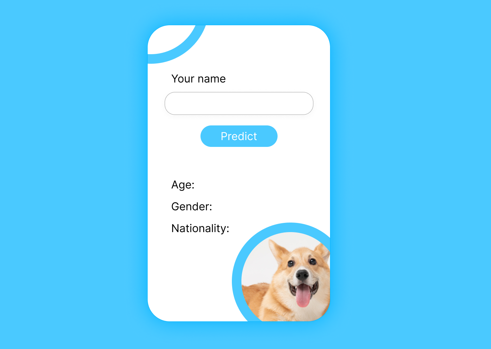

# prediction-website-frontend-api

### Assignment

You are asked to implement a full functional website: Prediction Website 
The website aims to predict the gender, age and the nationality of a given name. 
Everytime the website is loaded, it should show a random dog image. 
The user has to input his/her name on the website and click on a button
Once button clicked, you’re going to fetch three apis (one to get the predicted gender, one for the age, and one to get the predicted nationality - you might get two nationalities with different probabilities - show them both)
Design the website the way you want but you should make it responsive and “cute”. 
The whole project should be one page based. 
You are not allowed to use axios. You have to use the fetch() function. 
The api for getting the gender is: https://api.genderize.io?name=rio 
The api for getting the age is: https://api.agify.io/?name=nour 
The api for getting the nationality: https://api.nationalize.io/?name=mohamad 
The api for getting the dog images: https://dog.ceo/api/breeds/image/random 
Deadline: 10 Sept 2022 Sunday 10:00 AM. 
Deliverable: GitHub Repo Link (You have to create a branch and keep on pushing to it, before submitting you have to merge to the main branch) 

Figma exported design for the project (created by me)

